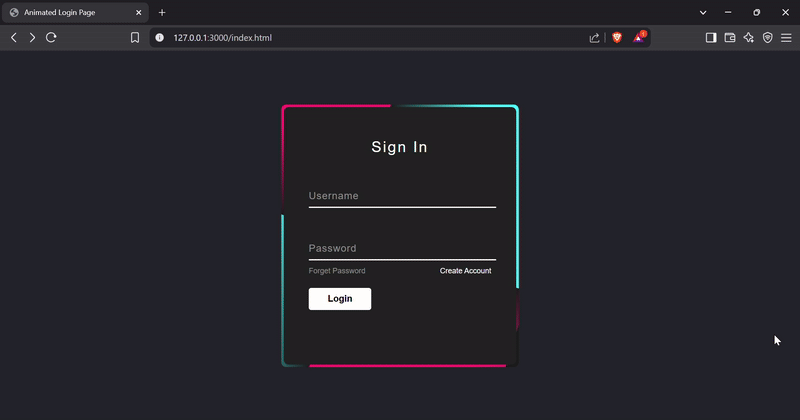

# Animated Login Page - Modern UI Design



## 🚀 Project Overview

This animated login page features a sleek, modern design with captivating visual effects that will impress both users and employers. The project showcases:

- **Eye-catching animated borders** with gradient effects
- **Smooth input field transitions** for enhanced user experience
- **Clean, minimalist design** with perfect alignment and spacing
- **Responsive layout** that works on various screen sizes

## ✨ Key Features

- **Dynamic CSS Animations**: Rotating gradient borders create a visually striking effect
- **Interactive Form Elements**:
  - Floating labels that animate when focused
  - Underline effects that expand into full backgrounds
  - Smooth transitions for all interactive elements
- **Modern Color Scheme**: Professional dark theme with accent colors
- **Perfect Pixel Implementation**: Meticulous attention to detail in spacing and alignment

## 🛠️ Technologies Used

- **HTML5** semantic structure
- **CSS3** animations and transitions
- **Pure CSS** (no JavaScript) for all animations
- **Flexbox** for perfect centering
- **Poppins** modern font family

## 💡 Why This Stands Out

This project demonstrates:

1. **Advanced CSS Skills**: Complex animations using only CSS
2. **UI/UX Understanding**: Thoughtful interactions that guide users
3. **Attention to Detail**: Pixel-perfect implementation
4. **Clean Code**: Well-structured and commented
5. **Performance**: Lightweight with smooth animations

## 🔧 Installation

Simply clone the repository and open `index.html` in any modern browser:

```bash
git clone https://github.com/ogidy/Animated-Login-Form.git
cd Animated-Login-Form
```
